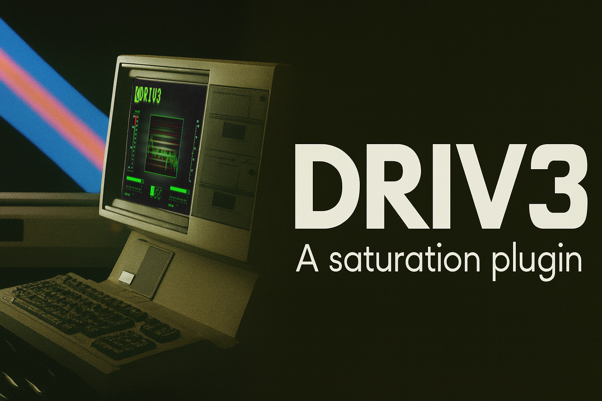

<!-- Recommended banner dimensions: 1280x640 pixels. Please replace 'path/to/your/banner.png' with the actual path to your banner image. -->

# Driv3 saturation plugin

## Overview

`Driv3` is a modern C++17 audio saturation plugin developed using the JUCE framework. It is designed to function as both a VST3 plugin for seamless integration into Digital Audio Workstations (DAWs) and a standalone application for independent use.

## Features

- **Three saturation types:** Soft clip, Hard clip and custom Fuzz clip.
- **Frequency visualisation:** Using the Juce fast fourier transformation class.
- **GUI designed in figma for retro aesthetic**

## Getting Started

To build and run `Driv3 saturation plugin`, you will need the following:

### Prerequisites (for VSCode)

- A C++20 compatible compiler is required. Here are some common examples:
  * Windows: Visual Studio 2019 (v16.10) or newer. Visual Studio 2022 is recommended.
  * macOS: Xcode 13 or newer (Apple Clang 13+). Your CI uses Xcode 16.2, so that's a known good version.
  * Linux: GCC 10 or newer, or Clang 12 or newer.

- Cmake 4.2.0 (https://cmake.org/download)
- C/C++ extension and Cmake tools extension (https://marketplace.visualstudio.com/items?itemName=ms-vscode.cpptools-extension-pack)

### Building the Project

1. From the project root run "cmake -S . -B build"
2. Then to build the project run "cmake --build build"

(If you want to build the release version run "cmake --build build --config Release")

## Usage

### As a VST3 Plugin

1.  The generated `.vst3` file should automatically be copied to your DAW's VST3 plugin folder (e.g., `C:\Program Files\Common Files\VST3` on Windows, `/Library/Audio/Plug-Ins/VST3` on macOS).
2.  Rescan your plugin folders within your DAW.
3.  Insert `Driv3 saturation plugin` as an effect or instrument on an audio track.

### As a Standalone Application
In VSCode:
- Ctrl + Shift + P > Run without debugging

## TODOs

- Fix slider bounds so that the sliderthumb is correctly positioned and stays within bounds.
- Add effects to the background to make it look more realistic.
- Add light beam that moves across the screen. (Could be animation or a gif).
- Add presetbrowser and ability to save presets.

## Contributing

Contributions are welcome! Please feel free to fork the repository, make your changes, and submit a pull request.
